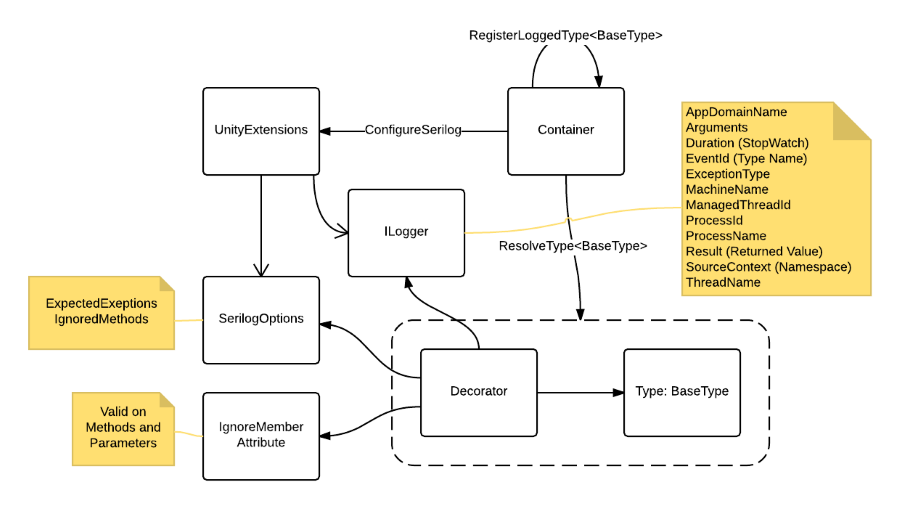

# Unity.Interception.Serilog

## Vad är Unity.Interception.Serilog?

Med hjälp av Unity.Interception så dekoreras registrerade typer med loggning. Loggarna innehåller information om anropen så som exempelvis exekveringstid, argument och resultat, och persisteras via Serilogs ILogger. All loggning via ILogger berikas med en samling fält som beskriver miljön där loggningen har skett.



*Översikt av Unity.Iterception.Serilog*

## Konfiguration

Via extension-metoden `ConfigureSerilog` registreras Serilogs `ILogger` i containern och dess `LoggerConfiguration` exponeras via en `Action`-parameter. Möjlighet att konfigurera förväntade exceptions samt metoder som ska undantas från loggning finns också.

```charp
using Unity.Interception.Serilog;
...
var container = new UnityContainer();
var expectedExceptions = new[] {typeof (InvalidOperationException)};
var ignoredMethods = new[] { new MethodIdentifier(typeof(IMyType), nameof(IMyType.DoStuff)) };
container
    .ConfigureSerilog(c => c.WriteTo.Xyz(...), expectedExceptions, ignoredMethods);
``` 

Konfigurationen av Serilog görs i exemplet via `c.WriteTo.Xyz(...)` och ersätts med den sink som man vill använda istället. För `Serilog.Sinks.Elasticsearch` så kan anropet exempelvis göras som `c.WriteTo.Elasticsearch("http://localhost:9200", "myindex-{0:yyyy.MM.dd}")`. Det är valbart om parametrarna `expectedExceptions` och `ignoredMethods` ska anges eller inte.

Som alternativ till att i `ConfigureSerilog` skicka med en lista med ignorerade metoder kan man använda sig av attributet `IgnoreMember`.

```charp
using Unity.Interception.Customization;
...
public interface IMyType
{
    [IgnoreMember]
    void DoSecretStuff();

    void DoStuffWithSecretParameter(string username, [IgnoreMember] string password);
}
```

Som synes fungerar attributet även på parametrar. Är det inte önskvärt att logga en viss parameter, så kan man inte konfigurera detta via `ConfigureSerilog`, utan `IgnoreMember` är enda alternativet. 

För att slå på loggning för en viss typ görs registrering via någon av extension-metoderna:

```charp
using Unity.Interception.Serilog;
...
var container = new UnityContainer();
container
    .RegisterLoggedType<IMyType, MyType>();
    .RegisterLoggedInstance<IMyType>(new MyType());
```
## Loggning

All loggning via Serilogs `ILogger` berikas med de properties som tas upp i [CommonProperties.cs](/tfs/DefaultCollection/Innovation/Team/_git/Unity.Interception.Serilog?path=%2Fsrc%2FUnity.Interception.Serilog%2FCommonProperties.cs&version=GBmaster&_a=contents).

### Loggning av metodanrop

För alla loggade metodanrop tas förutom gemensamma propertiesarna även dessa med:

* `SourceContext`: Namespace och typnamn
* `EventId`: Metodnamn
* `Arguments`: En lista med metodens argument och värden.
* `Result`: Metodens resultat, om metoden har sådant. 

För argument och resultat görs `ToString()` och inte någon serialisering på grund av prestandaskäl.

Då exception loggas tas fälten `Exception` och `ExceptionType` även med.

### Loggning av event

Eftersom metoden `ConfigureSerilog` registrerar `ILogger` i containern kan man i klassen där man vill logga ta in `ILogger` som ett beroende via konstruktorn.

```charp
internal class MyType
{
    private readonly ILogger _logger;

    public MyType(ILogger logger)
    {
        _logger = logger;
    }

    public void DoStuff()
    {
        _logger.Information(...);
        ...
    }
}

```

Vill man i eventloggen ha med SourceContext och EventId på samma sätt som i loggningen av metodanropen, kan man göra det genom:
```
_logger.ForContext<MyType>().ForContext("EventId", nameof(DoStuff)).Information(...)
```

## Hur kommer jag igång?

För att skapa en solution med exempelvis MVC som loggar till Elasticsearch görs följande. I en ASP.NET Web Application, kör följande i Package Manager Console:

```
Install-Package Unity.Interception.Serilog -Prerelease -Source http://ts-czc322767n/nugetserver/nuget
Install-Package Serilog.Sinks.ElasticSearch
Update-Package Elasticsearch.Net
Install-Package Unity.Mvc
Update-Package WebActivatorEx
```

Uppdatera `RegisterTypes` i App_Start/UnityConfig.cs till:

```charp
public static void RegisterTypes(IUnityContainer container)
{
    string logUri = ConfigurationManager.AppSettings["LogUri"];
    string indexFormat = ConfigurationManager.AppSettings["LogIndexFormat"];
    container
        .ConfigureSerilog(c => c.WriteTo.Elasticsearch(logUri, indexFormat))
        .RegisterLoggedType<IApplicationService, ApplicationService>()
}
```

I exemplet så hämtas konfigurationsparametrar till Elasticsearch från AppSettings i Web.Config.

## Links

* [Serilog Wiki](https://github.com/serilog/serilog/wiki/Getting-Started)
* [Patterns & Practices - Unity.Interception](https://msdn.microsoft.com/en-us/library/dn178466.aspx)

